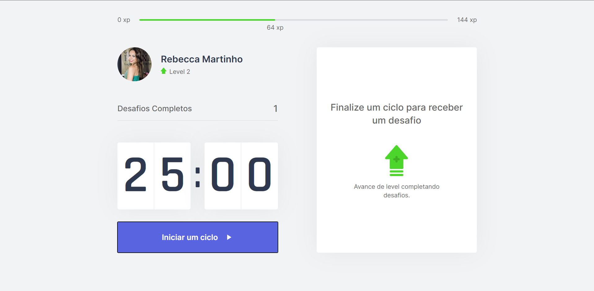
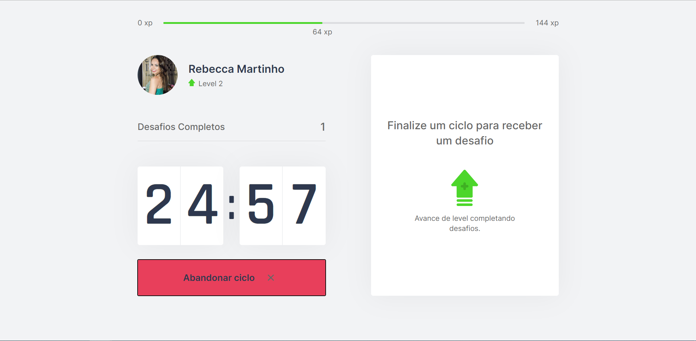
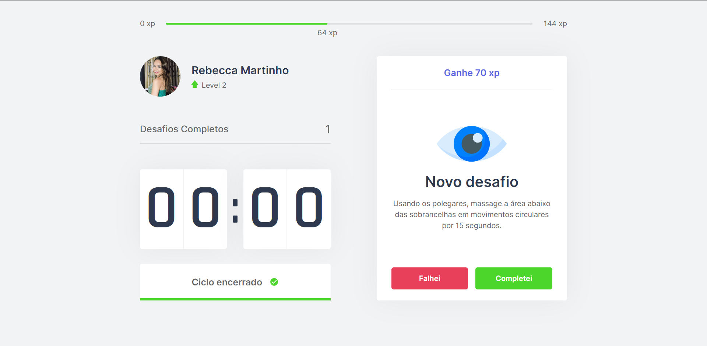
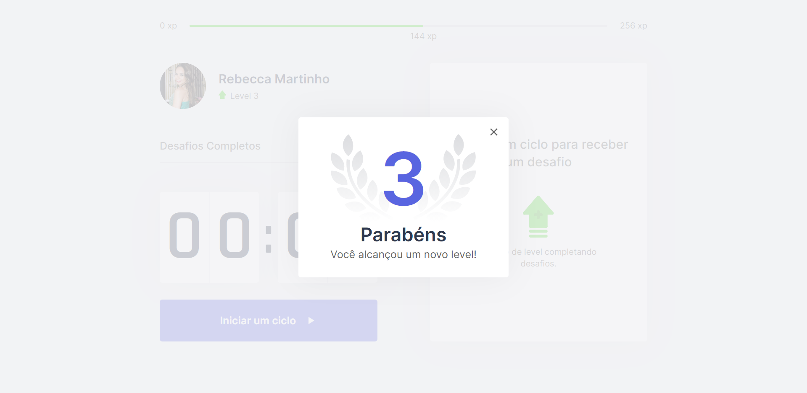

# Move.it | Next Level Week #04

Criado durante a [Next Level Week 04](https://nextlevelweek.com/inscricao/4), o Move.it é uma plataforma que utiliza a técnica do pomodoro com o objetivo de melhorar sua produtividade e foco.


 
 

## :art: Figma
Acesse o layout original [aqui](https://www.figma.com/file/ge20pu3ofMOKoliUyKx1Nl/Move.it-1.0?node-id=160%3A2761)

## :rocket: Tecnologias

* [Next.js](https://nextjs.org/)
* [React](https://pt-br.reactjs.org/)
* [Typescript](https://www.typescriptlang.org/)

## :computer: Rodando o Move.it

Abra um terminal e copie este repositório com o comando
```sh

$ git clone https://github.com/RebeccaMartinho/moveit-nlw4.git
# ou faça o download
```

Entre na pasta web com 
```sh
$ cd moveit-next

```
Instale as dependências
```sh
$ yarn install
```
Rode a aplicação

```sh
$ yarn dev
```

Acesse http://localhost:3000 no seu navegador

